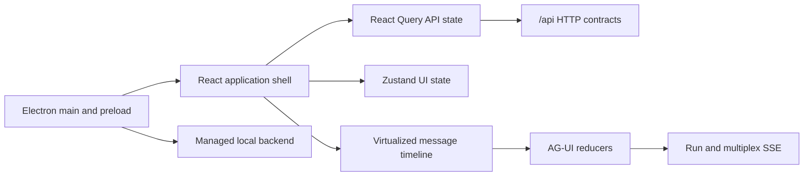

# Frontend Architecture

## Runtime Shape

V2 is a React 19 and TypeScript SPA. Vite emits its hashed assets to `frontend/dist/`; the V1 build then copies the independently maintained `frontend/legacy/src/` bundle to `frontend/dist/v1/`. Starlette serves V2 at `/` and V1 at `/v1/`. Both use the same origin-relative `/api/*` boundary and expose a bidirectional version switch. Electron starts the same backend, waits for health, and initially loads V2 at the root URL.

## Layers

- App layer: providers, bootstrap readiness, localization, and theme.
- Feature layer: shell navigation, workspace/session inventory, chat, settings, automation, skills, board, search, connectors, memory, observability, and project views.
- Runtime layer: typed AG-UI events, event cursors, replay-safe reducers, stream ownership, and recovery state.
- API layer: typed HTTP clients and query keys.
- Desktop layer: isolated preload APIs, backend process lifecycle, safe external links, and release paths.

## State Ownership

Backend APIs own persisted workspaces, sessions, rounds, runs, settings, and recovery snapshots. React Query owns fetched server state. Zustand owns local presentation preferences such as navigation and panel geometry. Runtime reducers own the ordered visible projection of replayed and live events.

A session switch never transfers stream ownership. Each tracked stream retains its session and run identity, cursor, and terminal state, so returning to a session reconstructs exact content without duplicate or reordered rows.

## Security

The Electron renderer runs with Node integration disabled, context isolation enabled, and sandboxing enabled. The preload exposes only version, backend status, safe external-link, diagnostics-copy, and retry operations. Process management remains in the main process.
